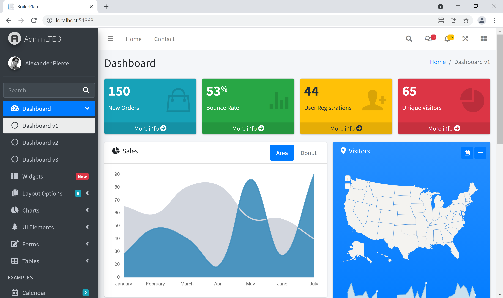

# A MES Of Blazor WASM and AdminLTE.io v3

This project is following [this artical](https://www.freecodecamp.org/news/how-to-perform-crud-operations-using-blazor-with-mongodb-8ee216ad513e/) to create web api. Make sure to install MongoDB and initialize all collections before get your hands dirty

## Gallery

## Credits

- [AdminLTE v3](https://adminlte.io/)
